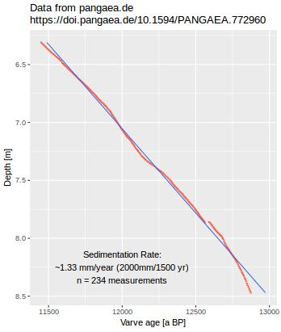

htmltable_2_R
=============

**This simple R script is from 2013, when I was learning to get web-data into R, and to create plots. Quite an experience for me, back when I just started using R.**

There is just one R script. It imports environmental science-data (~ 1kB) directly from the internet, via screen-scraping, then generates a simple X-Y-scatterplot using the `qplot()` function of the popular *ggplot2* library. *(Update 2017: I would do this differently now, using `tidyverse`  packages)*

Geological data are fetched from the science-data repository https://pangaea.de, using *Rcurl*. The R code selects the HTML table on the page with an xpath expression, creates a data frame, generates the simple X-Y plot. 
At this time, only a single column is plotted.

The [sample dataset](https://doi.pangaea.de/10.1594/PANGAEA.772960?format=html) - ages of sediment layers  from Lake Rehwiese in the Berlin/Brandenburg area- 
 is simple+small. This geochronology data is easy to understand, and has some relevance to my work.

For other data sets from pangaea.de, or to select other columns: - Must change the source code, or use [ROpenSci's `pangaear` package](https://ropensci.github.io/pangaear/). See [get_with_pangaear.R](get_with_pangaear.R) for a rewrite of the `get_from_pangaea.R` script.

Two sample [outfiles (in JPG Format), from 2013 and 2018](/rehwiese.jpg) are shown below. 

 

Again, I was not involved in creating this dataset, I just selected it because of its small size and simple structure. I'm not interpreting the data here. 

Todo: make the xpath-expression, and the selection of columns in the plot, a command line option. ~~Flip the coordinate axes~~. 

